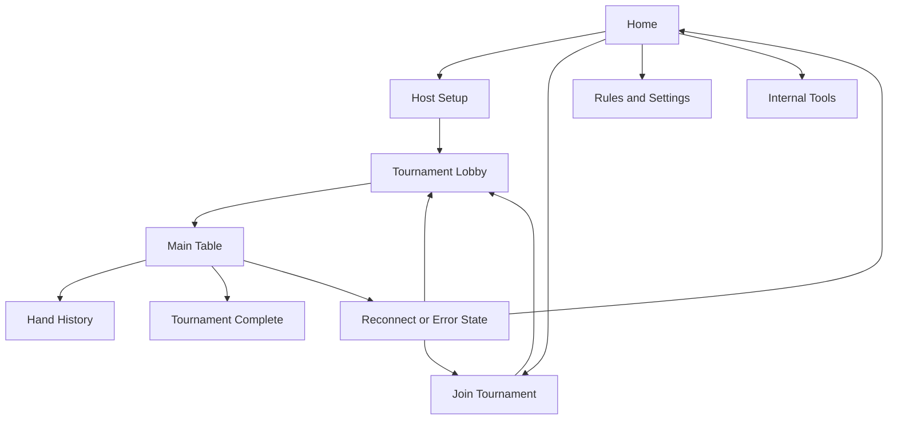

# UI/UX Redesign TODO

This TODO list translates [USER_WORKFLOW.md](/home/phil/work/desktop_poker/docs/USER_WORKFLOW.md) into a practical redesign backlog.

Status legend:

- [x] done
- [ ] not done yet

## 1. Define redesign goals and constraints

- [x] Write a short UX problem statement for the current app
  - [x] Describe why the current UI feels unreasonable
  - [x] Identify where the app currently feels like internal tooling instead of a player product
  - [x] Define the desired product feel in one paragraph
- [x] Define the primary user promise
  - [x] Hosting a game should feel simple
  - [x] Joining a game should feel simple
  - [x] Playing should feel obvious
  - [x] Recovering from failure should feel safe
- [x] Define hard UX constraints
  - [x] Keep core player flows primary
  - [x] Keep multi-instance and debug flows secondary
  - [x] Keep recovery flows contextual instead of always-visible
  - [x] Keep copy short and low-text where possible
  - [x] Avoid screens that exist only to expose internal app structure

## 2. Audit the current UX against the workflow document

- [x] Perform a screen-by-screen UX audit
  - [x] Home screen
  - [x] Host setup
  - [x] Join tournament
  - [x] Lobby
  - [x] Ready room
  - [x] Main table
  - [x] Hand history
  - [x] Rules/help
  - [x] Tournament complete
  - [x] Error and reconnect states
  - [x] Debug/internal tools
- [x] For each screen, document the following
  - [x] User goal on that screen
  - [x] Primary CTA
  - [x] Secondary CTAs
  - [x] Information needed before action
  - [x] Information that is currently noise
  - [x] Copy that sounds technical or internal
  - [x] UI elements that create hesitation or ambiguity
- [x] Identify structural UX problems
  - [x] Duplicate screens for the same user goal
  - [x] Screens that break flow momentum
  - [x] Navigation items that expose route structure instead of task structure
  - [x] Screens that should be merged
  - [x] Screens that should be hidden from main navigation

## 3. Redefine the information architecture

- [x] Define the primary app structure around user intent
  - [x] Host
  - [x] Join
  - [x] Play
  - [x] History
- [x] Define what belongs outside primary navigation
  - [x] Rules/help
  - [x] Settings or profile details
  - [x] Recovery states
  - [x] Tournament complete summary
  - [x] Debug/internal tools
- [x] Decide whether the app should use task-based navigation instead of route-based navigation
  - [x] Evaluate whether sidebar navigation is appropriate at all times
  - [x] Evaluate whether some screens should be full-flow states instead of navigation destinations
- [x] Define a simpler top-level navigation model
  - [x] Pre-tournament navigation model
  - [x] In-tournament navigation model
  - [x] Post-tournament navigation model

## 4. Redesign the core player flows

### 4.1 Host flow

- [x] Redesign the host journey end-to-end
  - [x] Define the shortest path from app open to host setup
  - [x] Define the minimum required host settings
  - [x] Remove non-essential decisions from the first host step
  - [x] Make LAN readiness understandable in plain language
  - [x] Make join payload sharing an obvious next action
  - [x] Make the transition from setup to lobby feel continuous
- [x] Simplify host screen sequence
  - [x] Decide whether host setup and lobby should remain separate
  - [x] Decide whether ready-room logic should be absorbed into lobby
  - [x] Ensure the host can understand when the game is startable
- [x] Redesign host-specific actions
  - [x] Share invite
  - [x] Review players joined
  - [x] Confirm player readiness
  - [x] Start tournament
  - [x] Handle missing LAN or missing players gracefully

### 4.2 Join flow

- [x] Redesign the join journey end-to-end
  - [x] Define the shortest path from app open to payload entry
  - [x] Make payload entry the obvious main action
  - [x] Make payload validation immediate and understandable
  - [x] Show a short confirmation of who and what the player is joining
  - [x] Make the post-validation next step obvious
- [x] Simplify join screen sequence
  - [x] Decide whether join confirmation and lobby should be separate
  - [x] Ensure the user is not bounced between too many pre-play screens
  - [x] Make recent payloads helpful rather than cluttered
- [x] Redesign join-specific actions
  - [x] Paste payload
  - [x] Validate payload
  - [x] Clear or replace payload
  - [x] Continue to lobby
  - [x] Recover from invalid payload

### 4.3 Ready / pre-start flow

- [x] Decide whether there should be a separate ready room at all
  - [x] Compare lobby-only readiness vs separate ready-room screen
  - [x] Remove any stage that does not represent a distinct user goal
- [x] Define the minimum pre-start state users need to see
  - [x] Who is seated
  - [x] Who is ready
  - [x] Whether the game can start
  - [x] What each user should do next
- [x] Define a single clear pre-start CTA per role
  - [x] Host CTA
  - [x] Joiner CTA

### 4.4 Main table flow

- [x] Redesign the main table as the product center
  - [x] Make turn ownership immediately visible
  - [x] Make player status easy to scan
  - [x] Make pot, board, and stacks readable at a glance
  - [x] Make local player cards visually obvious
  - [x] Make legal actions unambiguous
- [x] Reduce table noise
  - [x] Remove non-essential explanatory text
  - [x] Remove debug-like presentation from player-facing areas
  - [x] Prevent secondary panels from overpowering the main action area
- [x] Redesign action controls
  - [x] Fold
  - [x] Check/call
  - [x] Bet/raise
  - [x] All-in
  - [x] Disabled or unavailable states
- [x] Define table-adjacent secondary views
  - [x] Standings
  - [x] Hand history
  - [x] Public tournament state
  - [x] Connection status

### 4.5 Observer flow after elimination

- [x] Redesign the eliminated-player experience
  - [x] Make it immediately clear the player is now observing
  - [x] Remove action affordances that no longer apply
  - [x] Keep public state and standings visible
  - [x] Preserve dignity of the user state so it does not feel like a broken screen

### 4.6 Tournament completion flow

- [x] Redesign the end-of-tournament experience
  - [x] Show clear completion state
  - [x] Show winner and final standings clearly
  - [x] Offer next actions with minimal clutter
  - [x] Link naturally into hand history or restart actions

### 4.7 Hand history flow

- [x] Redesign the history experience
  - [x] Clarify whether this is live history, saved summary, or both
  - [x] Improve the empty state
  - [x] Improve scanability of settled hands
  - [x] Make outcomes understandable at a glance

## 5. Redesign multi-instance and debug flows so they stop leaking into the main UX

- [x] Separate normal user UX from internal tooling
  - [x] Remove debug/internal routes from primary player navigation
  - [x] Define where debug tools live instead
  - [x] Define what should be visible only in debug builds
- [x] Improve multi-instance usability for development without polluting player UX
  - [x] Make instance identity obvious in dev contexts
  - [x] Make payload copy/reuse easy in dev contexts
  - [x] Make extra-instance launch actions fast in dev contexts
- [x] Audit copy for internal language leakage
  - [x] Remove protocol-centric language from player screens
  - [x] Remove storage-centric language from player screens
  - [x] Keep technical labels only where they truly help QA or debugging

## 6. Redesign recovery and error flows

- [x] Define a consistent error-state design model
  - [x] What happened
  - [x] What it means for the user
  - [x] What the user can do next
  - [x] Whether recovery is automatic or manual
- [x] Redesign join failure states
  - [x] Invalid payload
  - [x] Expired or unusable payload
  - [x] Join rejected
  - [x] Host unreachable
- [x] Redesign host failure states
  - [x] No reachable LAN IP
  - [x] Port or networking setup failure
  - [x] Host startup failure
- [x] Redesign in-session recovery states
  - [x] Temporary disconnect
  - [x] Reconnecting
  - [x] Reconnected successfully
  - [x] Reconnect failed
  - [x] Tournament no longer available
- [x] Define recovery UX rules
  - [x] Never strand the user without a next action
  - [x] Never present technical diagnostics as the main message
  - [x] Preserve session continuity when possible

## 7. Rewrite the product copy

- [x] Create a copy style guide for the redesign
  - [x] Short sentences
  - [x] Clear verbs
  - [x] Minimal helper text
  - [x] No implementation jargon on player-facing screens
- [x] Rewrite core CTA labels
  - [x] Host Tournament
  - [x] Join Tournament
  - [x] Continue to Lobby
  - [x] Mark Ready
  - [x] Start Tournament
  - [x] Return to History or Home
- [x] Rewrite section headings to be task-based
  - [x] Replace technical labels with user-goal labels
- [x] Rewrite empty states
  - [x] No recent payloads
  - [x] No hand history
  - [x] No players yet
  - [x] Waiting for host
- [x] Rewrite error copy
  - [x] Clear cause in plain English
  - [x] Clear next action
  - [x] No excessive detail unless explicitly expanded

## 8. Build a coherent visual and interaction system

- [x] Define the visual hierarchy rules
  - [x] One primary CTA per screen
  - [x] Clear secondary actions
  - [x] Strong state hierarchy
  - [x] Strong emphasis for the current task
- [x] Define layout rules
  - [x] Maximum content width per screen type
  - [x] Spacing scale
  - [x] Card usage rules
  - [x] Sidebar vs full-screen rules
- [x] Define component behavior rules
  - [x] Buttons
  - [x] Form inputs
  - [x] Status badges
  - [x] Alerts
  - [x] Confirmation states
  - [x] Empty states
- [x] Define state presentation rules
  - [x] Loading
  - [x] Success
  - [x] Waiting
  - [x] Error
  - [x] Disabled
  - [x] Reconnecting
- [x] Improve responsiveness and readability
  - [x] Desktop layout at typical laptop size
  - [x] Narrow-window behavior
  - [x] Text density audit

## 9. Turn the redesign into explicit screen-level tasks

- [x] Home screen redesign brief
  - [x] Define one-sentence purpose of the screen
  - [x] Define two primary actions max
  - [x] Decide what supportive information belongs there
  - [x] Remove anything better placed deeper in a workflow
- [x] Host setup redesign brief
  - [x] Define required fields only
  - [x] Define when advanced options appear, if ever
  - [x] Define the exact next step after confirmation
- [x] Join screen redesign brief
  - [x] Center the payload action
  - [x] Define confirmation summary content
  - [x] Define recent payload interaction model
- [x] Lobby redesign brief
  - [x] Define what users need to know before start
  - [x] Define host actions vs joiner actions
  - [x] Decide whether ready-room behavior merges here
- [x] Main table redesign brief
  - [x] Define the first five things a user should notice
  - [x] Define active-turn treatment
  - [x] Define secondary panels and their priority
- [x] Hand history redesign brief
  - [x] Define list item structure
  - [x] Define filtering or grouping needs
  - [x] Define saved vs live history language
- [x] Help/rules redesign brief
  - [x] Decide whether it belongs in primary navigation
  - [x] Reduce it to support content rather than a main path
- [x] Tournament complete redesign brief
  - [x] Define summary content
  - [x] Define next actions

## 10. Prototype before implementation

- [x] Create low-fidelity flow sketches
  - [x] Home -> Host
  - [x] Home -> Join
  - [x] Lobby / readiness
  - [x] Main table
  - [x] Hand history
  - [x] Error and reconnect states
- [x] Create screen transition map
  - [x] Core player transitions
  - [x] Recovery transitions
  - [x] Dev-only transitions
- [x] Review prototype against workflow goals
  - [x] Is the next step always obvious?
  - [x] Are there any screens with no clear user goal?
  - [x] Are debug flows visibly separated?
  - [x] Are error flows contextual instead of dominant?

Low-fidelity flow map:

Prototype review notes:

- [x] The next step is obvious on Home, Host, Join, Lobby, Table, History, Complete, and Error states.
- [x] Ready Room no longer exists as a separate player-facing stop with a duplicate user goal.
- [x] Debug flows are separated behind the internal tools entry and debug-only scenario picker.
- [x] Recovery states only appear as contextual surfaces, not as peers to Host and Join.

## 11. Define implementation sequencing

- [x] Sequence the redesign into phases
  - [x] Phase 1: information architecture and navigation cleanup
  - [x] Phase 2: host and join flow redesign
  - [x] Phase 3: lobby/ready-state redesign
  - [x] Phase 4: main table redesign
  - [x] Phase 5: hand history and completion states
  - [x] Phase 6: recovery and error states
  - [x] Phase 7: debug flow separation and polish
- [x] Define dependencies between screens
  - [x] Which screens must change together
  - [x] Which screens can be redesigned independently
- [x] Define validation gates before each phase ships
  - [x] Copy review
  - [x] Flow review
  - [x] Interaction review
  - [x] Test coverage review

Validation gates used in this redesign:

1. Update copy and structure in the smallest coherent slice.
2. Run focused tests for the touched slice immediately after the first edit.
3. Repair any expectation drift or local regressions in that same slice.
4. Run full frontend lint and frontend tests before commit.
5. Run Rust clippy and Rust tests when a Rust file is included in the commit.

## 12. Define acceptance criteria for a reasonable UI

- [x] Create a simple UX acceptance checklist
  - [x] A new user can tell the difference between Host and Join instantly
  - [x] A joining player can tell what to do with a payload instantly
  - [x] A lobby user always knows whether they are waiting, ready, or blocked
  - [x] A table user can tell whether it is their turn within seconds
  - [x] An eliminated player understands they are observing, not broken
  - [x] A disconnected player sees a clear recovery path
  - [x] A normal player never feels like they are using a debug tool
- [x] Create a heuristic review pass
  - [x] Clarity of next action
  - [x] Simplicity of copy
  - [x] Visual hierarchy
  - [x] Error recoverability
  - [x] Separation of player UX and dev UX

Heuristic review outcome:

- [x] Clarity of next action: Home, Join, Lobby, Table, and Error surfaces all expose a clear next step.
- [x] Simplicity of copy: helper text is shorter and backend-centric language was removed from player surfaces.
- [x] Visual hierarchy: the table is visually primary, while detail panels are secondary and optional.
- [x] Error recoverability: reconnect and failure states offer explicit next actions instead of dead-end messaging.
- [x] Separation of player UX and dev UX: debug tools are labeled internal and kept out of the normal player path.

## 13. Define testing and review tasks for the redesign

- [x] Update or add workflow-based UI tests once redesign work starts
  - [x] Host happy path
  - [x] Join happy path
  - [x] Pre-start readiness path
  - [x] Observer path
  - [x] Hand history path
  - [x] Reconnect path
- [x] Add manual review checklist for every redesigned screen
  - [x] Primary CTA is obvious
  - [x] Copy is concise
  - [x] Technical details are not dominating the screen
  - [x] Empty state is clear
  - [x] Error state has a recovery action
- [x] Run a final app-level UX review
  - [x] Start from app open
  - [x] Host a game
  - [x] Join a game
  - [x] Reach table
  - [x] Finish a session
  - [x] Review history

Manual review checklist used:

- [x] Home: two primary entry points, minimal noise, support actions secondary.
- [x] Host Setup: clear step ordering, LAN readiness visible, share action obvious.
- [x] Join: payload first, destination confirmation second, lobby continuation third.
- [x] Lobby: readiness and startability visible without an extra screen.
- [x] Main Table: action ownership, cards, pot, and controls readable at a glance.
- [x] Hand History: fallback and empty states are honest and understandable.
- [x] Tournament Complete: final order and next actions are clear.
- [x] Error States: every state gives a direct recovery action.

Final app-level UX review:

- [x] Start from app open: Host and Join are immediately distinct.
- [x] Host a game: setup to share to lobby reads as one continuous flow.
- [x] Join a game: paste, validate, and continue are now sequential and obvious.
- [x] Reach table: pre-start flow collapses cleanly into lobby then table.
- [x] Finish a session: completion and history now feel like end-state surfaces instead of placeholders.
- [x] Review history: saved and live history both have clear presentation and fallback behavior.

## 14. Immediate next tasks

- [x] Convert this TODO into a prioritized execution order
- [x] Map each existing screen to one of three categories
  - [x] keep
  - [x] merge
  - [x] hide or remove from primary UX
- [x] Create a screen-by-screen redesign brief for the core flow first
  - [x] Home
  - [x] Host setup
  - [x] Join
  - [x] Lobby
  - [x] Main table

Prioritized execution order used:

1. Simplify top-level navigation and home entry.
2. Clarify Host and Join as separate user intentions.
3. Merge Ready Room behavior into Lobby.
4. Center the product on the Main Table.
5. Improve History and Tournament Complete as real supporting surfaces.
6. Separate Debug from player UX.
7. Make reconnect and failure states explicit and recoverable.

## Screen disposition

- Keep: Home, Host Setup, Join Tournament, Tournament Lobby, Main Table, Hand History, Tournament Complete, Rules / Settings.
- Merge: Ready Room into Lobby.
- Hide from primary UX: Debug tools and internal scenario-picking surfaces.

## Remaining work

- None. This checklist is complete; future work should start as a new follow-on backlog.